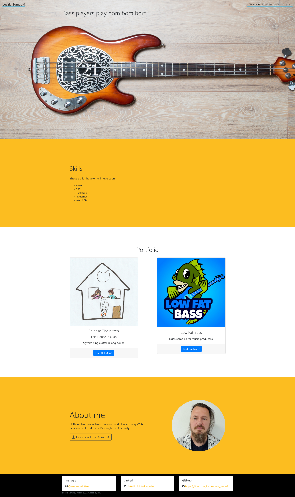
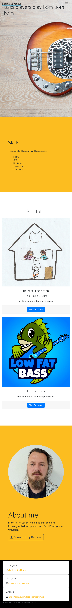

# Bootcamp Module 3 Challenge - Bootstrap Portfolio
## Description
This website is an enhancement to the previous module challege. 
The site has the following functionalities:
* Bootstrap elements
* Navigation Bar at the top
* Jumbotron
    * Some quote
    * A background image
    * My picture is moved to the About me section
* Portfolio section 
    * Bootstrap cards for each project
* Skills section
    * List out the skills I expect to learn from the bootcamp
* About me
    * An About Me section in the same row.
* A footer section
* All hyperlinks has a hover effect
* All buttons displays a box shadow upon hover
* A modal window (bonus content) 

## Live URL
https://laszlosomogyimusic.github.io/Bootstrap-Portfolio/

## Reused Code
I have copied the Portfolio and the About Me section from an internal project to better understand the page alignment and custom modifier classes.

## Mock-up
### Wide Screen (laptop or PC)

### Small Screen (smartphone)

